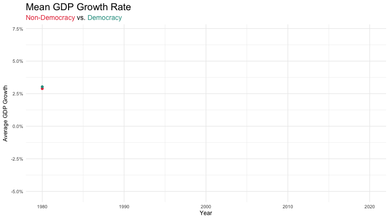

```{r setup}
library(tidyverse)
library(purrr)
library(countrycode)
library(ggridges)
library(scales)
library(gt)
library(broom)
library(gganimate)
library(gifski)
```

```{r data-prep}
as_boolish <- function(x) {
  case_when(
    as.character(x) %in% c("TRUE", "True", "true", "1", "Yes", "yes") ~ TRUE,
    as.character(x) %in% c("FALSE", "False", "false", "0", "No", "no") ~ FALSE,
    TRUE ~ NA
  )
}

continent_cols <- c(
  "Africa" = "#E63946",
  "Americas" = "#F4A261",
  "Asia" = "#2A9D8F",
  "Europe" = "#457B9D",
  "Oceania" = "#9B5DE5"
)

democracy_cols <- c(
  "FALSE" = "#E63946",
  "TRUE" = "#2A9D8F"
)

democracy_data <- readr::read_csv(
  "https://raw.githubusercontent.com/rfordatascience/tidytuesday/main/data/2024/2024-11-05/democracy_data.csv",
  show_col_types = FALSE
) |>
  mutate(
    across(
      any_of(c("is_female_monarch", "is_female_president", "is_democracy")),
      as_boolish
    )
  )

masterSet <- readr::read_csv("masterSet.csv", show_col_types = FALSE) |>
  mutate(
    year = parse_number(as.character(year)),
    gdp_nominal = parse_number(as.character(gdp_nominal)),
    gdp_growth = parse_number(as.character(gdp_growth)),
    unemployment_rate = parse_number(as.character(unemployment_rate)),
    across(
      any_of(c("is_democracy", "is_female_monarch", "is_female_president")),
      as_boolish
    )
  )

regime_by_country <- democracy_data |>
  arrange(country_name, year) |>
  group_by(country_name) |>
  summarise(
    n_changes = sum(regime_category_index != lag(regime_category_index), na.rm = TRUE),
    .groups = "drop"
  )

top_regime <- regime_by_country |>
  slice_max(n_changes, n = 10, with_ties = FALSE) |>
  mutate(
    continent = countrycode(country_name, "country.name", "continent")
  )

regime_year_continent <- democracy_data |>
  arrange(country_name, year) |>
  group_by(country_name) |>
  mutate(regime_changed = regime_category_index != lag(regime_category_index)) |>
  ungroup() |>
  mutate(
    continent = countrycode(country_name, "country.name", "continent")
  ) |>
  filter(!is.na(continent))

continent_summary <- regime_year_continent |>
  group_by(continent, country_name) |>
  summarise(
    country_changes = sum(regime_changed, na.rm = TRUE),
    .groups = "drop"
  ) |>
  group_by(continent) |>
  summarise(
    Countries = n(),
    `Total Changes` = sum(country_changes),
    `Average per Country` = round(mean(country_changes), 2),
    `Most Unstable Country` = country_name[which.max(country_changes)],
    .groups = "drop"
  ) |>
  arrange(desc(`Total Changes`))

cumulative_regime <- regime_year_continent |>
  group_by(continent, year) |>
  summarise(
    n_changes = sum(regime_changed, na.rm = TRUE),
    .groups = "drop"
  ) |>
  group_by(continent) |>
  mutate(cumulative_changes = cumsum(n_changes)) |>
  ungroup()

female_leader_summary <- function(data, group_var) {
  data |>
    rowwise() |>
    mutate(
      female_leader = any(
        c_across(c(is_female_monarch, is_female_president)),
        na.rm = TRUE
      )
    ) |>
    ungroup() |>
    group_by(across(all_of(group_var))) |>
    summarise(
      `Country-Years` = n(),
      `Female Leader Share` = mean(female_leader, na.rm = TRUE),
      .groups = "drop"
    ) |>
    filter(
      !is.na(.data[[group_var]]),
      `Female Leader Share` > 0
    ) |>
    arrange(desc(`Female Leader Share`))
}

female_regime <- female_leader_summary(democracy_data, "regime_category") |>
  slice_head(n = 10)

female_election <- female_leader_summary(democracy_data, "election_system") |>
  filter(election_system != "?") |>
  slice_head(n = 10)

growth_by_democracy <- masterSet |>
  group_by(year, is_democracy) |>
  summarise(
    mean_growth = mean(gdp_growth, na.rm = TRUE),
    .groups = "drop"
  ) |>
  filter(!is.na(mean_growth), !is.na(is_democracy))

female_growth <- masterSet |>
  rowwise() |>
  mutate(
    female_leader = any(
      c_across(c(is_female_monarch, is_female_president)),
      na.rm = TRUE
    )
  ) |>
  ungroup() |>
  filter(
    !is.na(gdp_growth),
    year >= 2015,
    year <= 2020
  )

model_data <- masterSet |>
  filter(
    !is.na(gdp_nominal),
    gdp_nominal > 0,
    !is.na(unemployment_rate),
    !is.na(is_democracy),
    !is.na(year),
    year != 2020
  )

lmGDP <- lm(
  log(gdp_nominal) ~ unemployment_rate * is_democracy + year,
  data = model_data
)

model_results <- tidy(lmGDP) |>
  mutate(
    term = case_when(
      term == "(Intercept)" ~ "Intercept",
      term == "unemployment_rate" ~ "Unemployment Rate",
      term == "is_democracyTRUE" ~ "Is Democracy",
      term == "year" ~ "Year",
      term == "unemployment_rate:is_democracyTRUE" ~ "Unemployment × Democracy",
      TRUE ~ term
    ),
    across(c(estimate, std.error, statistic), ~ round(.x, 4)),
    p.value = case_when(
      p.value < 0.001 ~ "< 0.001",
      TRUE ~ as.character(round(p.value, 3))
    )
  )

model_stats <- glance(lmGDP)

n_countries <- n_distinct(democracy_data$country_name)
year_range <- paste0(min(democracy_data$year), "–", max(democracy_data$year))
top_country <- top_regime$country_name[1]
top_changes <- top_regime$n_changes[1]
total_changes <- sum(regime_by_country$n_changes, na.rm = TRUE)
```

# Overview

<!-- #### Regime Changes by Continent -->

<!-- ```{r} -->
<!-- #| fig-height: 5.2 -->

<!-- cumulative_regime |> -->
<!--   ggplot(aes( -->
<!--     x = year, -->
<!--     y = cumulative_changes, -->
<!--     color = continent, -->
<!--     fill = continent -->
<!--   )) + -->
<!--   geom_area(alpha = 0.25, position = "identity") + -->
<!--   geom_line(linewidth = 0.9) + -->
<!--   scale_color_manual(values = continent_cols) + -->
<!--   scale_fill_manual(values = continent_cols) + -->
<!--   labs( -->
<!--     title = "Cumulative Regime Changes by Continent", -->
<!--     subtitle = "1950–2022", -->
<!--     x = "Year", -->
<!--     y = "Cumulative Changes", -->
<!--     color = "Continent", -->
<!--     fill = "Continent" -->
<!--   ) + -->
<!--   theme_minimal(base_size = 12) + -->
<!--   theme( -->
<!--     plot.title = element_text(face = "bold"), -->
<!--     legend.position = "right" -->
<!--   ) -->
<!-- ``` -->

<!-- ### Snapshot and Tables {.tabset width="50%"} -->


<!-- #### Female Leadership by Regime Type -->

<!-- ```{r} -->
<!-- female_regime |> -->
<!--   rename(`Regime Category` = regime_category) |> -->
<!--   gt() |> -->
<!--   tab_header( -->
<!--     title = "Female Leadership by Regime Type", -->
<!--     subtitle = "Top nonzero categories" -->
<!--   ) |> -->
<!--   fmt_percent(columns = `Female Leader Share`, decimals = 1) |> -->
<!--   tab_style( -->
<!--     style = list( -->
<!--       cell_fill(color = "#18bc9c"), -->
<!--       cell_text(color = "white", weight = "bold") -->
<!--     ), -->
<!--     locations = cells_column_labels() -->
<!--   ) |> -->
<!--   tab_options( -->
<!--     table.width = pct(100), -->
<!--     table.font.size = px(11), -->
<!--     data_row.padding = px(3) -->
<!--   ) |> -->
<!--   opt_stylize(style = 1) -->
<!-- ``` -->

<!-- #### Female Leadership by Election -->

<!-- ```{r} -->
<!-- female_election |> -->
<!--   rename(`Election System` = election_system) |> -->
<!--   gt() |> -->
<!--   tab_header( -->
<!--     title = "Female Leadership by Election System", -->
<!--     subtitle = "Top nonzero categories" -->
<!--   ) |> -->
<!--   fmt_percent(columns = `Female Leader Share`, decimals = 1) |> -->
<!--   tab_style( -->
<!--     style = list( -->
<!--       cell_fill(color = "#18bc9c"), -->
<!--       cell_text(color = "white", weight = "bold") -->
<!--     ), -->
<!--     locations = cells_column_labels() -->
<!--   ) |> -->
<!--   tab_options( -->
<!--     table.width = pct(100), -->
<!--     table.font.size = px(11), -->
<!--     data_row.padding = px(3) -->
<!--   ) |> -->
<!--   opt_stylize(style = 1) -->
<!-- ``` -->


## GDP By Democracy Status

```{r}
#| fig-height: 4.4
#| title: GDP By Democracy Status

g1 <- growth_by_democracy |>
  ggplot(aes(
    x = year,
    y = mean_growth,
    group = factor(is_democracy),
    color = factor(is_democracy)
  )) +
  geom_line(linewidth = 1.2) +
  geom_point(size = 2) +
  transition_reveal(year) +
  scale_color_manual(
    values = democracy_cols,
    labels = c("FALSE" = "Non-Democracy", "TRUE" = "Democracy")
  ) +
  scale_y_continuous(labels = scales::label_number(suffix = "%")) +
  labs(
    title = "Mean GDP Growth Rate",
    subtitle = "<span style='color:#E63946; font-weight:bold;'>Non-Democracy</span> vs. <span style='color:#2A9D8F; font-weight:bold;'>Democracy</span>",,
    x = "Year",
    y = "Average GDP Growth",
    color = NULL
  ) +
  theme_minimal(base_size = 12) +
  theme(
    plot.title = element_text(face = "bold", size = 20),
    plot.subtitle = ggtext::element_markdown(size = 14),
    legend.position = "none"
  )
anim <- animate(
  g1,
  nframes = 100,
  fps = 10,
  width = 800,
  height = 450,
  renderer = gifski_renderer("gdp_growth_animation.gif"))


```

<!-- ### GDP by Female Leadership -->

<!-- ```{r} -->
<!-- #| fig-height: 4.4 -->

<!-- female_growth |> -->
<!--   mutate( -->
<!--     female_leader = if_else(female_leader, "Female Leader", "No Female Leader"), -->
<!--     year = factor(year) -->
<!--   ) |> -->
<!--   ggplot(aes( -->
<!--     x = gdp_growth, -->
<!--     y = year, -->
<!--     fill = female_leader -->
<!--   )) + -->
<!--   geom_density_ridges( -->
<!--     alpha = 0.65, -->
<!--     color = "white", -->
<!--     scale = 0.95, -->
<!--     rel_min_height = 0.01 -->
<!--   ) + -->
<!--   scale_x_continuous( -->
<!--     limits = c(-15, 20), -->
<!--     labels = label_number(suffix = "%") -->
<!--   ) + -->
<!--   scale_fill_manual(values = c( -->
<!--     "No Female Leader" = "#457B9D", -->
<!--     "Female Leader" = "#F4A261" -->
<!--   )) + -->
<!--   labs( -->
<!--     title = "GDP Growth by Female Leadership Status", -->
<!--     subtitle = "2015–2020", -->
<!--     x = "GDP Growth Rate", -->
<!--     y = NULL, -->
<!--     fill = NULL -->
<!--   ) + -->
<!--   theme_ridges(font_size = 12, grid = TRUE) + -->
<!--   theme( -->
<!--     legend.position = "top", -->
<!--     plot.title = element_text(face = "bold") -->
<!--   ) -->
<!-- ``` -->

## GDP Model


```{r}
#| fig-height: 4.4
#| title: Model Relationship

library(ggtext)

model_data |>
  ggplot(aes(
    x = unemployment_rate,
    y = log(gdp_nominal),
    color = factor(is_democracy)
  )) +
  geom_point(alpha = 0.12) +
  geom_smooth(method = "lm", se = FALSE, linewidth = 1.1) +
  scale_color_manual(
    values = democracy_cols,
    labels = c("FALSE" = "Non-Democracy", "TRUE" = "Democracy")
  ) +
  labs(
    title = "Unemployment and Log GDP",
    subtitle = "<span style='color:#E84A5F; font-weight:bold;'>Non-Democracy</span> vs. <span style='color:#18bc9c; font-weight:bold;'>Democracy</span>",
    x = "Unemployment Rate (%)",
    y = "Logged Nominal GDP",
    color = NULL
  ) +
  theme_minimal(base_size = 12) +
  theme(
    plot.title = element_text(face = "bold"),
    plot.subtitle = ggtext::element_markdown(size = 11),
    legend.position = "none"
  )
```


```{r}
#| title: Model Coefficients

model_results |>
  rename(
    Predictor = term,
    Effect = estimate,
    `Std. Error` = std.error,
    `p-value` = p.value
  ) |>
  mutate(
    Predictor = case_when(
      Predictor == "(Intercept)" ~ "Baseline GDP",
      Predictor == "unemployment_rate" ~ "Unemployment Rate",
      Predictor == "is_democracyTRUE" ~ "Democracy",
      Predictor == "year" ~ "Year",
      Predictor == "unemployment_rate:is_democracyTRUE" ~ "Unemployment × Democracy",
      TRUE ~ Predictor
    ),
    Direction = case_when(
      Effect > 0 ~ "Increases GDP",
      Effect < 0 ~ "Decreases GDP",
      TRUE ~ "No change"
    ),
    Significance = case_when(
      `p-value` < 0.001 ~ "***",
      `p-value` < 0.01  ~ "**",
      `p-value` < 0.05  ~ "*",
      TRUE ~ "Not significant"
    )
  ) |>
  select(Predictor, Direction, Effect, Significance) |>
  gt() |>
  tab_header(
    title = "Key Drivers of GDP",
    subtitle = "Linear regression predicting log nominal GDP"
  ) |>
  fmt_number(
    columns = Effect,
    decimals = 3
  ) |>
  cols_label(
    Predictor = "Factor",
    Direction = "Effect on GDP",
    Effect = "Estimate",
    Significance = "Evidence"
  ) |>
  tab_style(
    style = list(
      cell_fill(color = "grey40"),
      cell_text(color = "white", weight = "bold")
    ),
    locations = cells_column_labels()
  ) |>
  tab_style(
    style = cell_text(weight = "bold"),
    locations = cells_body(
      columns = Predictor
    )
  ) |>
  tab_style(
    style = cell_fill(color = "#e8f8f5"),
    locations = cells_body(
      rows = Direction == "Increases GDP"
    )
  ) |>
  tab_style(
    style = cell_fill(color = "#fdecea"),
    locations = cells_body(
      rows = Direction == "Decreases GDP"
    )
  ) |>
  tab_source_note(
    source_note = "* p < .05, ** p < .01, *** p < .001"
  ) |>
  tab_options(
    table.width = pct(100),
    table.font.size = px(13),
    data_row.padding = px(6),
    heading.title.font.size = px(18),
    heading.subtitle.font.size = px(12)
  ) |>
tab_source_note(
  source_note = "Finding: Democracy predicts higher GDP, but unemployment is linked to lower GDP, especially in democracies."
)
```
# Single Country

## Most Unstable Countries

```{r}
#| fig-height: 5.2

library(forcats)

top_regime_plot <- top_regime |>
  arrange(desc(n_changes)) |>
  mutate(
    country_name = fct_reorder(country_name, n_changes),
    continent = factor(continent, levels = unique(continent))
  )

top_regime_plot |>
  ggplot(aes(
    x = n_changes,
    y = country_name,
    fill = continent
  )) +
  geom_col(width = 0.75) +
  scale_fill_manual(
    values = continent_cols,
    breaks = levels(top_regime_plot$continent),
    na.value = "gray70"
  ) +
  labs(
    title = "Top 10 Most Politically Unstable Countries",
    subtitle = "Total regime changes, 1950–2022",
    x = "Number of Regime Changes",
    y = NULL,
    fill = "Continent"
  ) +
  theme_minimal(base_size = 12) +
  theme(
    legend.position = "right",
    legend.title = element_text(face = "bold"),
    legend.text = element_text(size = 10),
    plot.title = element_text(face = "bold", size = 16),
    plot.subtitle = element_text(size = 11),
    axis.text.y = element_text(size = 10),
    panel.grid.major.y = element_blank(),
    panel.grid.minor = element_blank()
  )
```

## Thailand

Thailand has been flagged the most politically unstable country in our data. We are going zoom in on the economic fluctuations Thailand experienced and look at potential factors for their situation


